# application testing and deployment in History 

## problesm 


## moving from bare-metal to virtual machines 

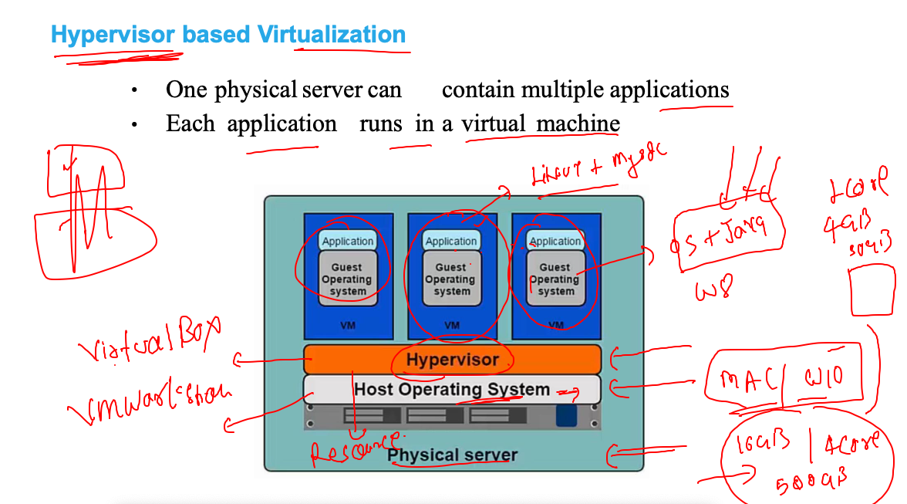

## problems with vm 

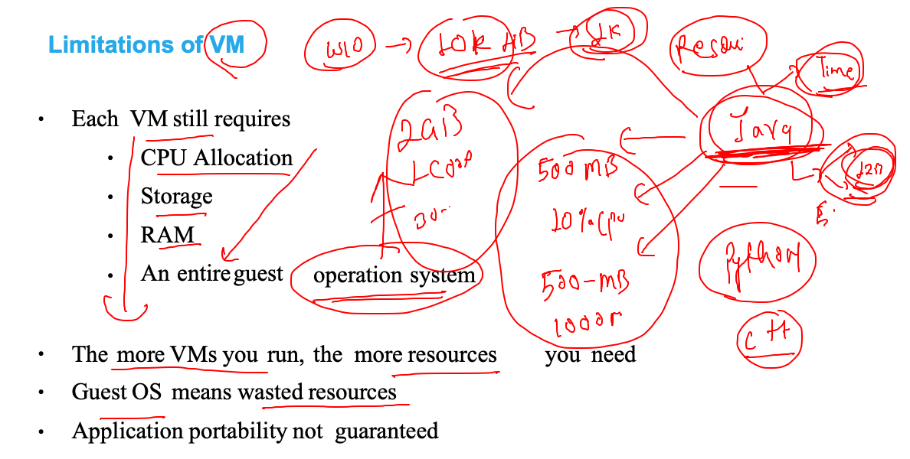

## kernel is OS 

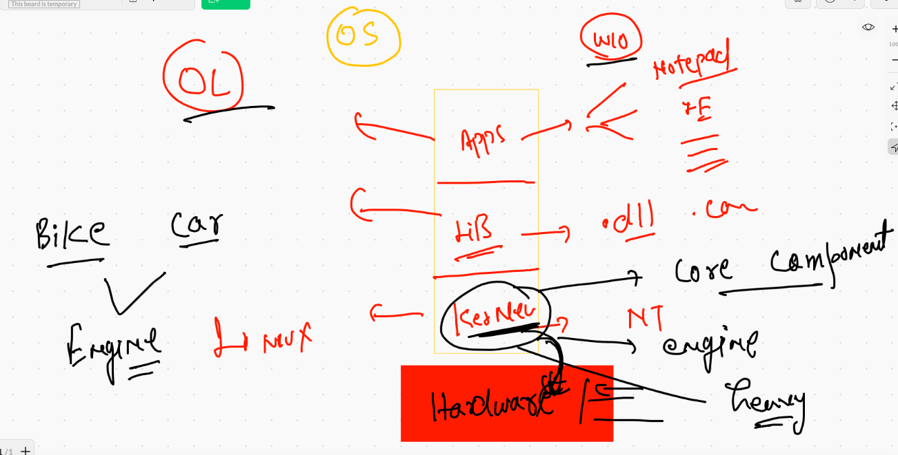

## vm vs containers 

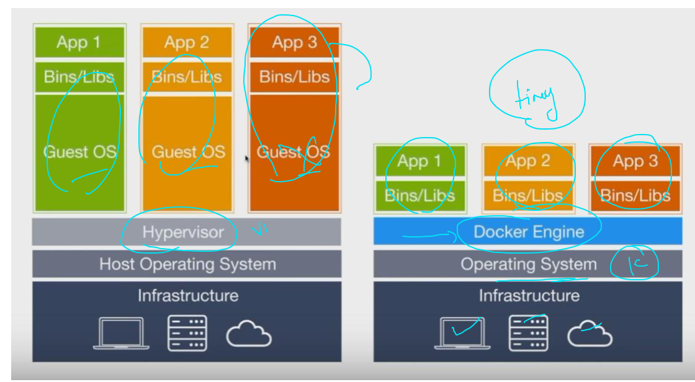


## CRE 


## Docker ce and ee 

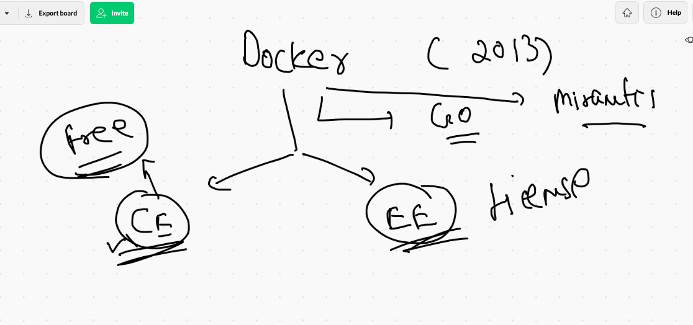

##  linux vs windows containers

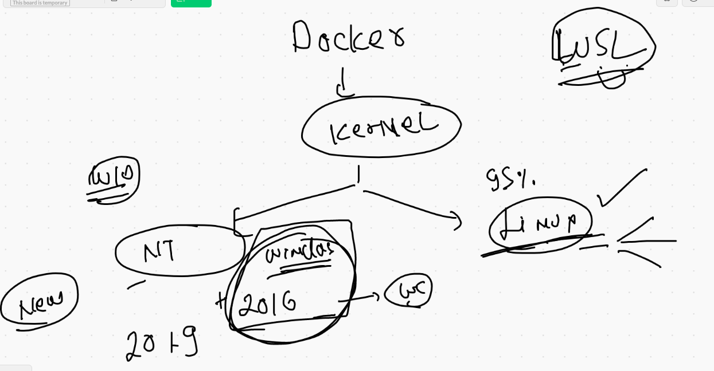

## Docker desktop for developers

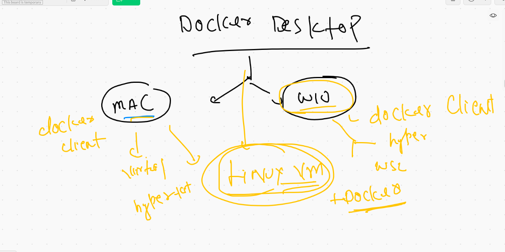

## Docker. desktop for mac 

[download](https://hub.docker.com/editions/community/docker-ce-desktop-mac)

## Docker desktop for windows 10 

[download](https://docs.docker.com/docker-for-windows/install/)


## after docker installation 

### Docker understanding for containers 

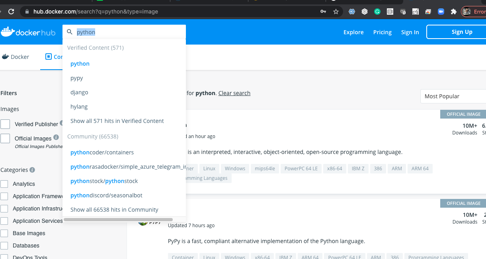


### docker hub 

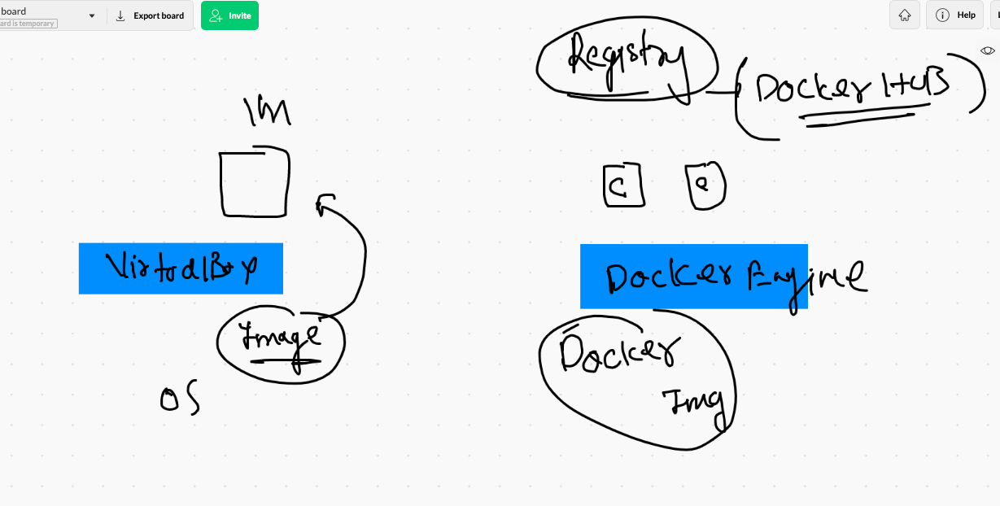

### Docker search 

```
❯ docker  search   tomcat
NAME                          DESCRIPTION                                     STARS     OFFICIAL   AUTOMATED
tomcat                        Apache Tomcat is an open source implementati…   3080      [OK]       
tomee                         Apache TomEE is an all-Apache Java EE certif…   91        [OK]       
dordoka/tomcat                Ubuntu 14.04, Oracle JDK 8 and Tomcat 8 base…   57                   [OK]
kubeguide/tomcat-app          Tomcat image for Chapter 1                      30                   
consol/tomcat-7.0             Tomcat 7.0.57, 8080, "admin/admin"              18                   [OK]
cloudesire/tomcat             Tomcat server, 6/7/8                            15                   [OK]
aallam/tomcat-mysql           Debian, Oracle JDK, Tomcat & MySQL              13                   [OK]
arm32v7/tomcat                Apache Tomcat is an open source implementati…   11                   
andreptb/tomcat               Debian Jessie based image with Apache Tomcat…   10                   [OK]
rightctrl/tomcat              CentOS , Oracle Java, tomcat application ssl…   6                    [OK]
unidata/tomcat-docker         Security-hardened Tomcat Docker container.      5                    [OK]
arm64v8/tomcat                Apache Tomcat is an open source implementati…   4                    
amd64/tomcat                  Apache Tomcat is an open source implementati…   3                    
jelastic/tomcat               An image of the Tomcat Java application serv…   2                    
oobsri/tomcat8                Testing CI Jobs with different names.           2                    
cfje/tomcat-resource          Tomcat Concourse Resource                       2                    
fabric8/tomcat-8              Fabric8 Tomcat 8 Image                       

```

### pulling docker images

```
[jitendra@ip-172-31-65-105 ~]$ docker  pull  openjdk 
Using default tag: latest
latest: Pulling from library/openjdk
1da50e1664e1: Pull complete 
e4c8e5a84542: Pull complete 
a5611f32ee23: Pull complete 
Digest: sha256:70a40f80e1cff29b88c529dc0c0444a21c2616d7f5a4ce65088585e1e71f07b9
Status: Downloaded newer image for openjdk:latest
docker.io/library/openjdk:latest


```

### docker operations

```
[jitendra@ip-172-31-65-105 ~]$ history 
    1  whoami
    2  docker  search   java
    3  docker  search mysql
    4  docker  pull  openjdk 
    5  docker  images
    6  docker  pull  oraclelinux:8.3 
    7  docker  pull    mysql
    8  history 
[jitendra@ip-172-31-65-105 ~]$ docker  images
REPOSITORY    TAG       IMAGE ID       CREATED        SIZE
openjdk       latest    c9022ce77bf9   3 days ago     467MB
mysql         latest    c60d96bd2b77   3 days ago     514MB
oraclelinux   8.3       816d99f0bbe8   3 months ago   224MB

```

## container and process understanding 

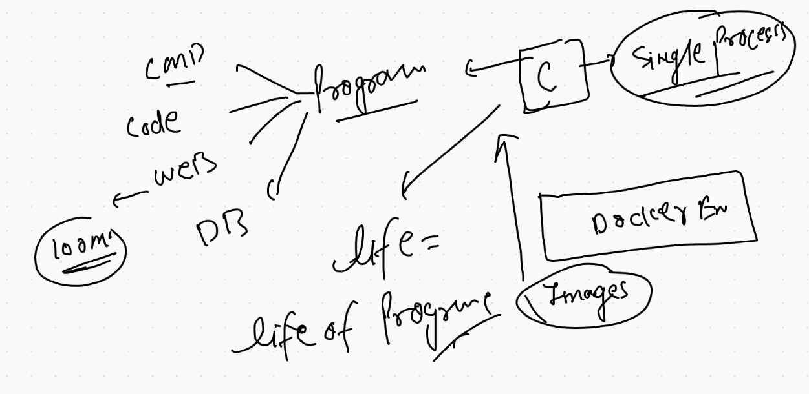

## creating first container 

```
[jitendra@ip-172-31-65-105 ~]$ docker  run  --name  ashuc1  alpine      ping  fb.com 
PING fb.com (157.240.229.35): 56 data bytes
64 bytes from 157.240.229.35: seq=0 ttl=51 time=0.762 ms
64 bytes from 157.240.229.35: seq=1 ttl=51 time=0.801 ms
64 bytes from 157.240.229.35: seq=2 ttl=51 time=0.790 ms
64 bytes from 157.240.229.35: seq=3 ttl=51 time=0.778 ms
64 bytes from 157.240.229.35: seq=4 ttl=51 time=0.794 ms
64 bytes from 157.240.229.35: seq=5 ttl=51 time=0.774 ms
^C
--- fb.com ping statistics ---
6 packets transmitted, 6 packets received, 0% packet loss
round-trip min/avg/max = 0.762/0.783/0.801 ms


```

### putting container in back ground 

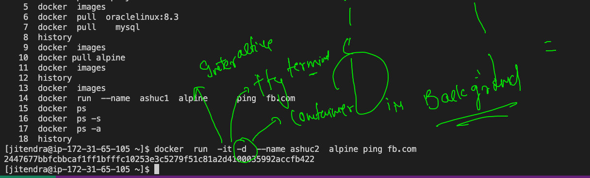

### default container and it list

```
[jitendra@ip-172-31-65-105 ~]$ docker  run  -it -d  --name ashuc2  alpine ping fb.com 
2447677bbfcbbcaf1ff1bfffc10253e3c5279f51c81a2d4100035992accfb422
[jitendra@ip-172-31-65-105 ~]$ docker  ps
CONTAINER ID   IMAGE     COMMAND         CREATED          STATUS          PORTS     NAMES
d0f0965642bf   alpine    "ping fb.com"   15 seconds ago   Up 14 seconds             shyju
eab302e0c39b   alpine    "ping fb.com"   16 seconds ago   Up 15 seconds             krishna1
2447677bbfcb   alpine    "ping fb.com"   3 minutes ago    Up 3 minutes              ashuc2
[jitendra@ip-172-31-65-105 ~]$ docker  ps

```

### docker ps and logs

```
 19  docker  run  -it -d  --name ashuc2  alpine ping fb.com 
   20  docker  ps
   21  docker  ps -a
   22  history 
   23  docker  ps
   24  docker  logs   ashuc2  
   25  docker  logs  -f  ashuc2  
   26  history 
[jitendra@ip-172-31-65-105 ~]$ docker  ps
CONTAINER ID   IMAGE     COMMAND         CREATED              STATUS              PORTS     NAMES
f1a781249fcd   alpine    "ping fb.com"   About a minute ago   Up About a minute             nishant2
6aeec1284c59   alpine    "ping fb.com"   2 minutes ago        Up 2 minutes                  palash3
7bae0443a240   alpine    "ping fb.com"   3 minutes ago        Up 3 minutes                  rashmialpine1
e91841e6f3af   alpine    "ping fb.com"   3 minutes ago        Up 3 minutes                  palash2
49ce70a05826   alpine    "ping fb.com"   4 minutes ago        Up 4 minutes                  bramha-it-d
07e63776f903   alpine    "ping fb.com"   4 minutes ago        Up 4 minutes                  jit121
d0f0965642bf   alpine    "ping fb.com"   4 minutes ago        Up 4 minutes                  shyju
eab302e0c39b   alpine    "ping fb.com"   4 minutes ago        Up 4 minutes                  krishna1
2447677bbfcb   alpine    "ping fb.com"   7 minutes ago        Up 7 minutes                  ashuc2

```

## starint a stopped container 

```
28  docker  stop   ashuc2 
   29  docker  ps
   30  docker  ps -a
   31  history 
[jitendra@ip-172-31-65-105 ~]$ docker  ps
CONTAINER ID   IMAGE     COMMAND         CREATED         STATUS         PORTS     NAMES
6aeec1284c59   alpine    "ping fb.com"   5 minutes ago   Up 5 minutes             palash3
7bae0443a240   alpine    "ping fb.com"   5 minutes ago   Up 5 minutes             rashmialpine1
e91841e6f3af   alpine    "ping fb.com"   5 minutes ago   Up 5 minutes             palash2
49ce70a05826   alpine    "ping fb.com"   6 minutes ago   Up 6 minutes             bramha-it-d
07e63776f903   alpine    "ping fb.com"   6 minutes ago   Up 6 minutes             jit121
d0f0965642bf   alpine    "ping fb.com"   6 minutes ago   Up 6 minutes             shyju
eab302e0c39b   alpine    "ping fb.com"   6 minutes ago   Up 6 minutes             krishna1
[jitendra@ip-172-31-65-105 ~]$ docker  start  ashuc2
ashuc2
[jitendra@ip-172-31-65-105 ~]$ docker  ps
CONTAINER ID   IMAGE     COMMAND         CREATED          STATUS         PORTS     NAMES
6aeec1284c59   alpine    "ping fb.com"   5 minutes ago    Up 5 minutes             palash3
7bae0443a240   alpine    "ping fb.com"   6 minutes ago    Up 6 minutes             rashmialpine1
e91841e6f3af   alpine    "ping fb.com"   6 minutes ago    Up 6 minutes             palash2
49ce70a05826   alpine    "ping fb.com"   7 minutes ago    Up 7 minutes             bramha-it-d
07e63776f903   alpine    "ping fb.com"   7 minutes ago    Up 7 minutes             jit121
2447677bbfcb   alpine    "ping fb.com"   10 minutes ago   Up 3 seconds             ashuc2

```

### to login in a running container as child process

```
[jitendra@ip-172-31-65-105 ~]$ docker  exec  -it  ashuc2  sh 
/ # 
/ # cat  /etc/os-release 
NAME="Alpine Linux"
ID=alpine
VERSION_ID=3.14.0
PRETTY_NAME="Alpine Linux v3.14"
HOME_URL="https://alpinelinux.org/"
BUG_REPORT_URL="https://bugs.alpinelinux.org/"
/ # 
/ # whoami
root
/ # ls
bin    dev    etc    home   lib    media  mnt    opt    proc   root   run    sbin   srv    sys    tmp    usr    var
/ # exit

```

