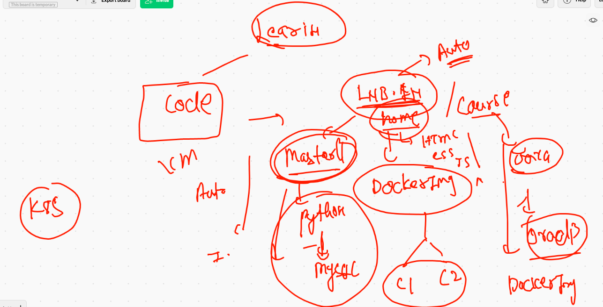
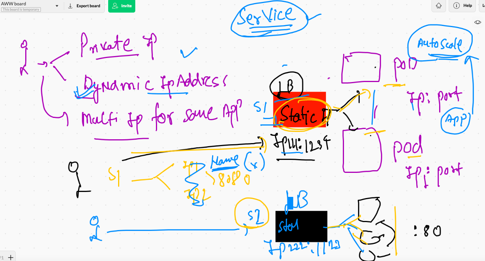
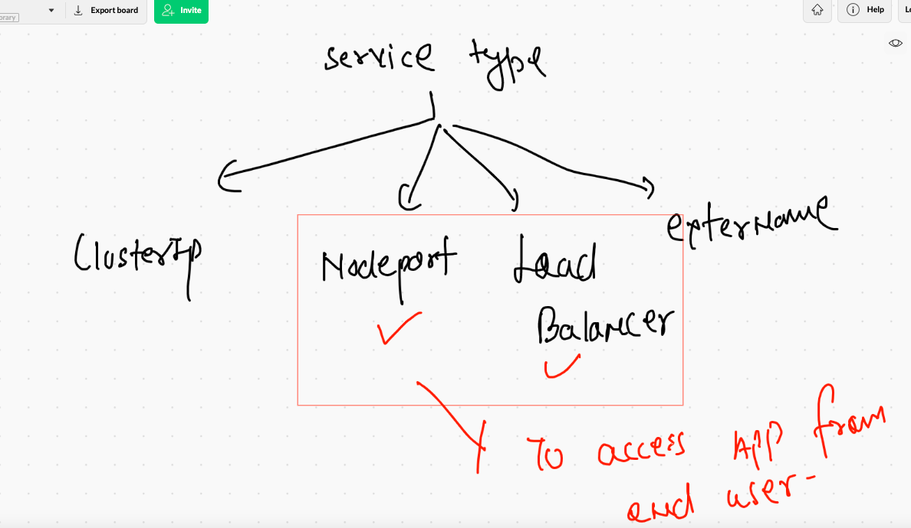
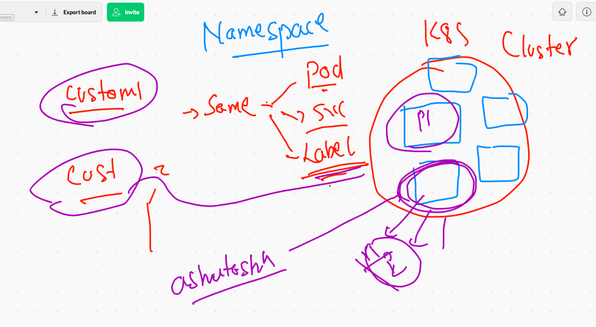
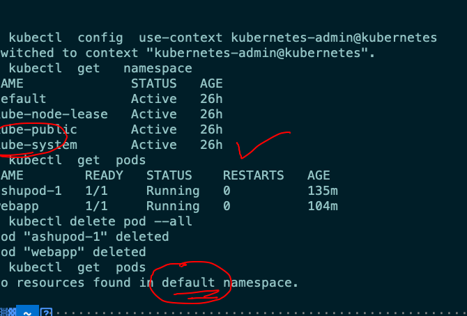
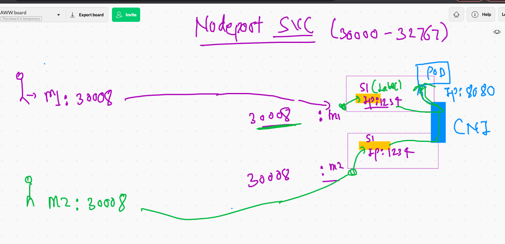
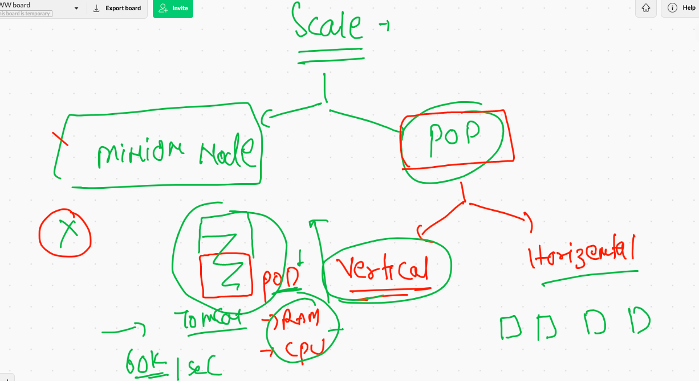
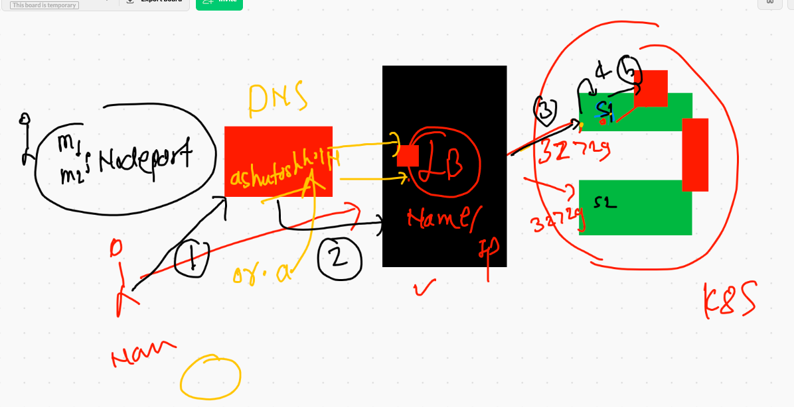
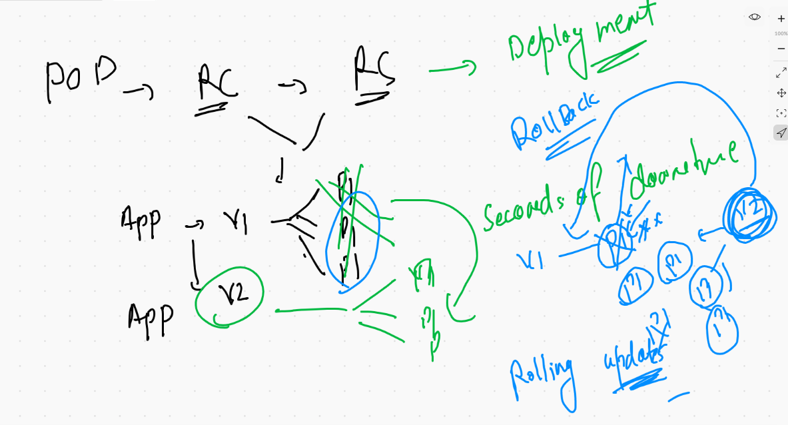

# Micro services discussion 



## service uses label concpet to find pod then forward traffic 



## service type 



## Namespace concpet in k8s



## default namespaces 



## 

```
❯ kubectl  get  ns
NAME              STATUS   AGE
default           Active   26h
kube-node-lease   Active   26h
kube-public       Active   26h
kube-system       Active   26h


```

## k8s internal components are in kube-system name-space

```
❯ kubectl   get  pods  -n  kube-system
NAME                                       READY   STATUS    RESTARTS   AGE
calico-kube-controllers-78d6f96c7b-d9v82   1/1     Running   2          26h
calico-node-6z8p6                          1/1     Running   2          26h
calico-node-dwd44                          1/1     Running   2          26h
calico-node-mxvrd                          1/1     Running   2          26h
coredns-558bd4d5db-996sj                   1/1     Running   2          26h
coredns-558bd4d5db-tpv2l                   1/1     Running   2          26h
etcd-masternode                            1/1     Running   2          26h
kube-apiserver-masternode                  1/1     Running   2          26h
kube-controller-manager-masternode         1/1     Running   2          26h
kube-proxy-czb9w                           1/1     Running   2          26h
kube-proxy-d9drj                           1/1     Running   2          26h
kube-proxy-ncjzq                           1/1     Running   2          26h
kube-scheduler-masternode                  1/1     Running   2          26h

```
### creating a namespace 

```
❯ kubectl  create  namespace  ashuproject  --dry-run=client -o yaml
apiVersion: v1
kind: Namespace
metadata:
  creationTimestamp: null
  name: ashuproject
spec: {}
status: {}
❯ kubectl  create  namespace  ashuproject
namespace/ashuproject created
❯ kubectl get  ns
NAME              STATUS   AGE
ashuproject       Active   10s
default           Active   26h
kube-node-lease   Active   26h
kube-public       Active   26h
kube-system       Active   26h

```

### changing. default namespace

```
❯ kubectl  config  set-context  --current  --namespace=ashuproject
Context "kubernetes-admin@kubernetes" modified.
❯ kubectl  get  po
No resources found in ashuproject namespace.
❯ 
❯ 
❯ kubectl  config  get-contexts
CURRENT   NAME                          CLUSTER      AUTHINFO           NAMESPACE
*         kubernetes-admin@kubernetes   kubernetes   kubernetes-admin   ashuproject
          minikube                      minikube     minikube           default
          
```

### deploying pod in custom namespace

```
 ls
ashupod1.yaml javapod.yaml
❯ kubectl  apply -f  javapod.yaml
pod/ashujavapod1 created
❯ kubectl  get  po
NAME           READY   STATUS    RESTARTS   AGE
ashujavapod1   1/1     Running   0          5s

```

###  checking label of pod 

```
❯ kubectl  get  po --show-labels
NAME           READY   STATUS    RESTARTS   AGE    LABELS
ashujavapod1   1/1     Running   0          2m2s   x=ashujavapp


```

### pod describe 

```
❯ kubectl  describe pod  ashujavapod1
Name:         ashujavapod1
Namespace:    ashuproject
Priority:     0
Node:         minion1/172.31.75.81
Start Time:   Thu, 29 Jul 2021 10:35:26 +0530
Labels:       x=ashujavapp
Annotations:  cni.projectcalico.org/podIP: 192.168.34.24/32
              cni.projectcalico.org/podIPs: 192.168.34.24/32
Status:       Running
IP:           192.168.34.24
IPs:
  IP:  192.168.34.24
Containers:
  ashujavapod1:
    Container ID:   docker://fd418c71386cdc8471edf8feeb0c281bc61fc0550e708c79205c637285ffc939
    Image:          dockerashu/ashujavaweb:v1
    Image ID:       docker-pullable://dockerashu/ashujavaweb@sha256:c4cc798b1cb55163e777886075a7f82a5d45f4b6c521be49fc12289487d879ba
    Port:           8080/TCP
    Host Port:      0/TCP
    State:          Running
      Started:      Thu, 29 Jul 2021 10:35:27 +0530
    Ready:          True
    Restart Count:  0
    Environment:    <none>
    Mounts:
      /var/run/secrets/kubernetes.io/serviceaccount from kube-api-access-hk9zg (ro)
Conditions:
  Type              Status
  Initialized       True 
  Ready             True 
  ContainersReady   True 
  PodScheduled      True 
Volumes:
  kube-api-access-hk9zg:
    Type:                    Projected (a volu
    
    
 ```
 
 ## nodeport. type service
 
 
 
 ## creating service 
 
 ```
 ❯ kubectl  create  service  nodeport   ashusvc1  --tcp  1234:8080  --dry-run=client -o yaml
apiVersion: v1
kind: Service
metadata:
  creationTimestamp: null
  labels:
    app: ashusvc1
  name: ashusvc1
spec:
  ports:
  - name: 1234-8080
    port: 1234
    protocol: TCP
    targetPort: 8080
  selector:
    app: ashusvc1
  type: NodePort
status:
  loadBalancer: {}
  
  
```

### NodePort service 

```
❯ kubectl  apply  -f  ashusvc1.yaml
service/ashusvc1 created
❯ kubectl  get  svc
NAME       TYPE       CLUSTER-IP      EXTERNAL-IP   PORT(S)          AGE
ashusvc1   NodePort   10.104.12.136   <none>        1234:31349/TCP   5s
❯ kubectl  get  service
NAME       TYPE       CLUSTER-IP      EXTERNAL-IP   PORT(S)          AGE
ashusvc1   NodePort   10.104.12.136   <none>        1234:31349/TCP   10s


```

## deleting pod and svc

```
❯ kubectl  get  po
NAME           READY   STATUS    RESTARTS   AGE
ashujavapod1   1/1     Running   0          61m
❯ kubectl  get  svc
NAME       TYPE       CLUSTER-IP      EXTERNAL-IP   PORT(S)          AGE
ashusvc1   NodePort   10.104.12.136   <none>        1234:31349/TCP   38m
❯ kubectl  delete all --all
pod "ashujavapod1" deleted
service "ashusvc1" deleted

```

### Deployment 

```
kubectl   create  deployment  ashudep1   --image=dockerashu/ashujavaweb:v1  --dry-run=client -o yaml
apiVersion: apps/v1
kind: Deployment
metadata:
  creationTimestamp: null
  labels:
    app: ashudep1
  name: ashudep1
spec:
  replicas: 1
  selector:
    matchLabels:
      app: ashudep1
  strategy: {}
  template:
    metadata:
      creationTimestamp: null
      labels:
        app: ashudep1
    spec:
      containers:
      - image: dockerashu/ashujavaweb:v1
        name: ashujavaweb
        resources: {}
status: {}


```

### deploy 

```
❯ kubectl  apply -f  dep.yaml
deployment.apps/ashudep1 created
service/ashusvc2 created
❯ kubectl  get  deploy
NAME       READY   UP-TO-DATE   AVAILABLE   AGE
ashudep1   1/1     1            1           5s
❯ kubectl  get  svc
NAME       TYPE       CLUSTER-IP     EXTERNAL-IP   PORT(S)          AGE
ashusvc2   NodePort   10.98.87.145   <none>        1234:30458/TCP   9s


```

## replace with kubectl 

```
❯ kubectl replace -f  dep.yaml --force
deployment.apps "ashudep1" deleted
service "ashusvc2" deleted
deployment.apps/ashudep1 replaced
service/ashusvc2 replaced

```


### scaling in k8s



### scaling pod manually 

```
❯ kubectl  scale  deploy  ashudep1  --replicas=5
deployment.apps/ashudep1 scaled
❯ kubectl   get  deploy
NAME       READY   UP-TO-DATE   AVAILABLE   AGE
ashudep1   2/5     5            2           14m
❯ kubectl  get  po
NAME                        READY   STATUS              RESTARTS   AGE
ashudep1-7d84b5c475-d8w6h   1/1     Running             0          80s
ashudep1-7d84b5c475-dtjfq   0/1     ContainerCreating   0          5s
ashudep1-7d84b5c475-svf8s   1/1     Running             0          14m
ashudep1-7d84b5c475-t7g7x   1/1     Running             0          5s
ashudep1-7d84b5c475-vw6xd   0/1     ContainerCreating   0          5s
❯ kubectl  get  po
NAME                        READY   STATUS    RESTARTS   AGE
ashudep1-7d84b5c475-d8w6h   1/1     Running   0          85s
ashudep1-7d84b5c475-dtjfq   1/1     Running   0          10s
ashudep1-7d84b5c475-svf8s   1/1     Running   0          14m
ashudep1-7d84b5c475-t7g7x   1/1     Running   0          10s
ashudep1-7d84b5c475-vw6xd   1/1     Running   0          10s
❯ kubectl   get  deploy
NAME       READY   UP-TO-DATE   AVAILABLE   AGE
ashudep1   5/5     5            5           14m

```

### cleaning my namespace 

```
❯ kubectl  delete all  --all
pod "ashudep1-7d84b5c475-svf8s" deleted
service "ashusvc2" deleted
deployment.apps "ashudep1" deleted

```

## sample app depoy from scratch 


```
1970  cd oraclewebapp
 1971  ls
 1972  docker  build -t   dockerashu/orwebapp:v1  . 
 1973  docker login -u dockerashu
 1974  docker  push  dockerashu/orwebapp:v1  
 1975  history
 1976  cd
 1977  history
 1978  kubectl  create  deployment  webapp  --image=dockerashu/orwebapp:v1  --dry-run=client -o yaml 
 1979  kubectl  create  deployment  webapp  --image=dockerashu/orwebapp:v1  --dry-run=client -o yaml >orweb.yaml
 
 ```
 
 ## creating service to auto match label of POD 
 
```
 kubectl  expose  deploy  webapp  --type NodePort  --port 80  --name  ashusvc123 --dry-run=client -o yaml
apiVersion: v1
kind: Service
metadata:
  creationTimestamp: null
  labels:
    app: webapp
  name: ashusvc123
spec:
  ports:
  - port: 80
    protocol: TCP
    targetPort: 80
  selector:
    app: webapp
  type: NodePort
status:
  loadBalancer: {}
  
 ```
 
## accessing app using domain 



## scaling app 

```
❯ kubectl  get  deploy
NAME     READY   UP-TO-DATE   AVAILABLE   AGE
webapp   1/1     1            1           89m
❯ kubectl  scale  deploy  webapp  --replicas=3
deployment.apps/webapp scaled
❯ kubectl  get  deploy
NAME     READY   UP-TO-DATE   AVAILABLE   AGE
webapp   3/3     3            3           89m

```

### deployment in real world



### updating image

```
2005  docker  build -t   dockerashu/orwebapp:v2  . 
 2006  history
 2007  docker  push dockerashu/orwebapp:v2
 2008  kubectl  get  deploy 
 2009  kubectl  describe  deploy  webapp
 2010  kubectl  set  image  deployment  webapp  orwebapp=dockerashu/orwebapp:v2  
 2011  kubectl  get  deploy 
 2012  kubectl  get  po 
 
 ```
 
 ### updatin image
 
 ```
 2005  docker  build -t   dockerashu/orwebapp:v2  . 
 2006  history
 2007  docker  push dockerashu/orwebapp:v2
 2008  kubectl  get  deploy 
 2009  kubectl  describe  deploy  webapp
 2010  kubectl  set  image  deployment  webapp  orwebapp=dockerashu/orwebapp:v2  
 2011  kubectl  get  deploy 
 2012  kubectl  get  po 
 
 ```
 
 ### rollback 
 
 ```
 010  kubectl  set  image  deployment  webapp  orwebapp=dockerashu/orwebapp:v2  
 2011  kubectl  get  deploy 
 2012  kubectl  get  po 
❯ kubectl  rollout  undo deploy  webapp
deployment.apps/webapp rolled back
❯ kubectl  rollout  undo deploy  webapp
deployment.apps/webapp rolled back

```

### Introduction to LB svc

```
❯ kubectl  get  deploy
NAME     READY   UP-TO-DATE   AVAILABLE   AGE
webapp   3/3     3            3           118m
❯ kubectl expose deploy webapp  --type LoadBalancer  --port 80 --name lbsvc
service/lbsvc exposed
❯ kubectl  get  svc
NAME         TYPE           CLUSTER-IP       EXTERNAL-IP   PORT(S)        AGE
ashusvc123   NodePort       10.109.254.187   <none>        80:32729/TCP   47m
lbsvc        LoadBalancer   10.104.87.14     <pending>     80:31965/TCP   8s

```

