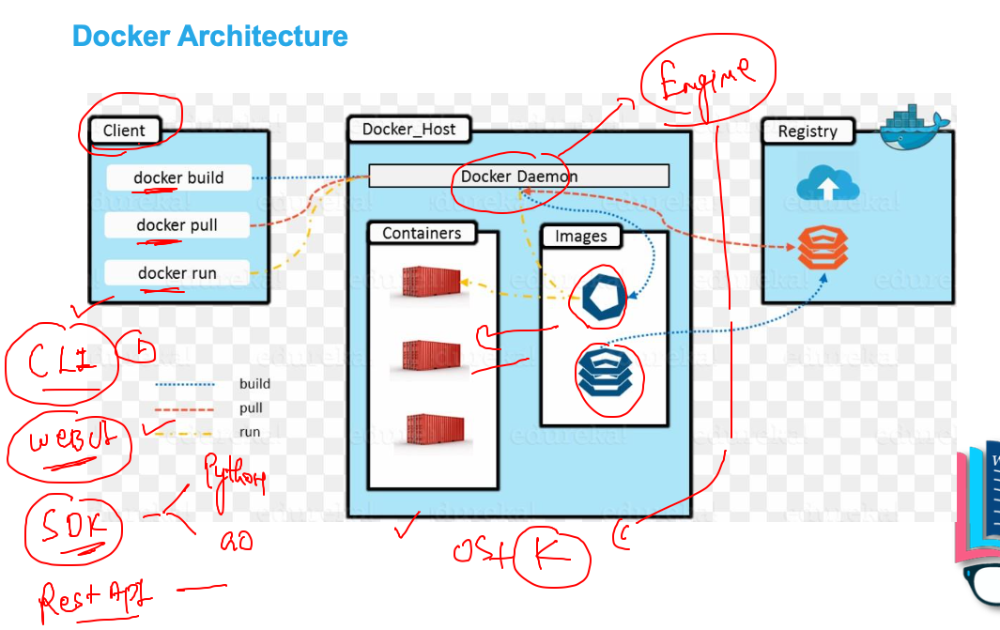
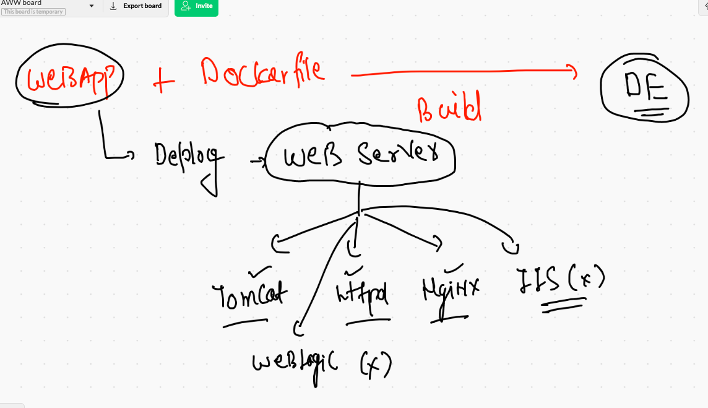
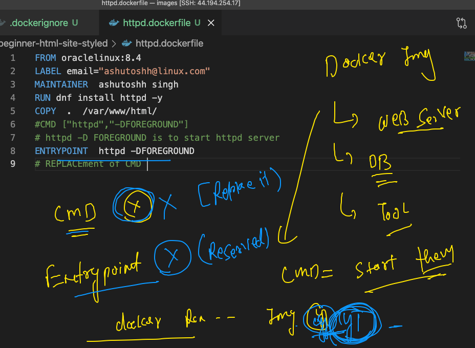

# Docker. client options 



## Deploy webui in Docker ENgine 

```
docker  run -itd --name webui -p 9000:9000 --restart always -v  /var/run/docker.sock:/var/run/docker.sock portainer/portainer 
Unable to find image 'portainer/portainer:latest' locally

```

## webapplications and webserver 



## cloning sample web app

```
ec2-user@ip-172-31-65-105 images]$ git clone  https://github.com/mdn/beginner-html-site-styled
Cloning into 'beginner-html-site-styled'...
remote: Enumerating objects: 40, done.
remote: Total 40 (delta 0), reused 0 (delta 0), pack-reused 40
Receiving objects: 100% (40/40), 124.07 KiB | 7.75 MiB/s, done.
Resolving deltas: 100% (10/10), done.
[ec2-user@ip-172-31-65-105 images]$ ls
beginner-html-site-styled  java  python

```

## Nginx image with web app

```
[ec2-user@ip-172-31-65-105 images]$ ls
beginner-html-site-styled  java  python
[ec2-user@ip-172-31-65-105 images]$ cd  beginner-html-site-styled/
[ec2-user@ip-172-31-65-105 beginner-html-site-styled]$ ls
CODE_OF_CONDUCT.md  Dockerfile  images  index.html  LICENSE  README.md  styles
[ec2-user@ip-172-31-65-105 beginner-html-site-styled]$ docker  build -t ashunginx:v1  . 
Sending build context to Docker daemon  63.49kB
Step 1/3 : FROM  nginx
 ---> 08b152afcfae
Step 2/3 : LABEL email="ashutoshh@linux.com"
 ---> Running in a2b4010fda30
Removing intermediate container a2b4010fda30
 ---> cf84e37df595
Step 3/3 : ADD . /usr/share/nginx/html/
 ---> cb3394f164ba
Successfully built cb3394f164ba
Successfully tagged ashunginx:v1

```

###  creating container 

```
docker  run -itd --name ashungc1 -p 1234:80 ashunginx:v1

```

## CMD vs ENTRYPOINT 



## building img

```
docker  build -t  ashuhttpd:v1 -f httpd.dockerfile  . 

```

