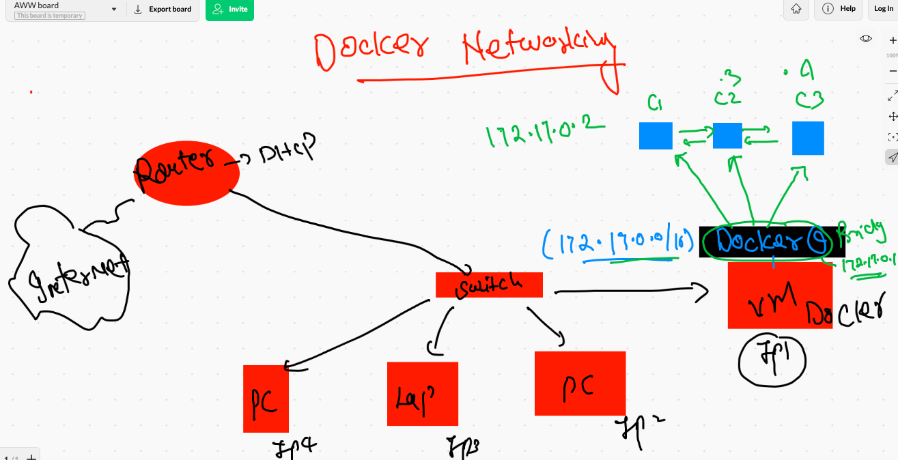
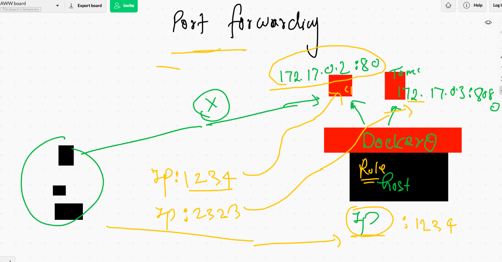
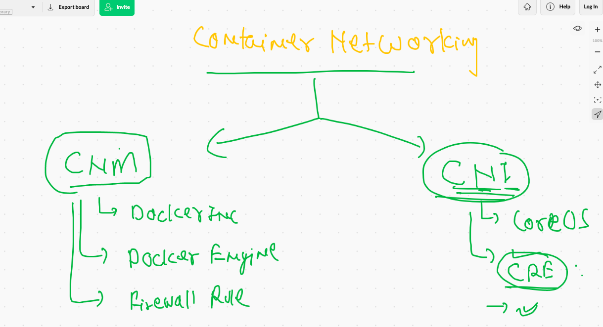
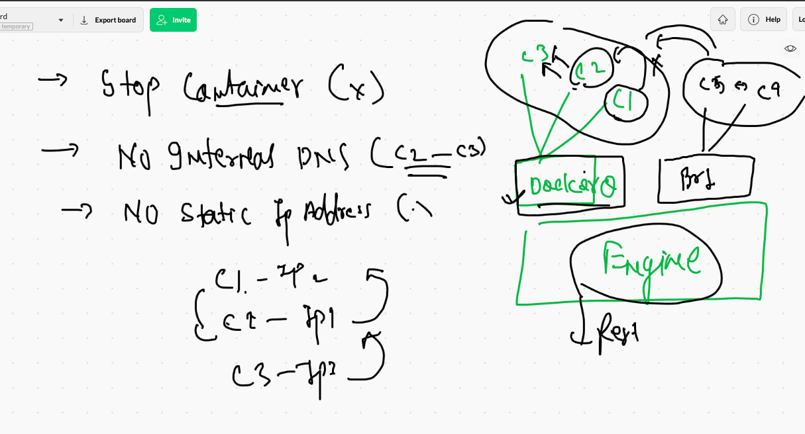

# Docker. client options 


## Deploy webui in Docker ENgine 

```
docker  run -itd --name webui -p 9000:9000 --restart always -v  /var/run/docker.sock:/var/run/docker.sock portainer/portainer 
Unable to find image 'portainer/portainer:latest' locally

```

## webapplications and webserver 


## cloning sample web app

```
ec2-user@ip-172-31-65-105 images]$ git clone  https://github.com/mdn/beginner-html-site-styled
Cloning into 'beginner-html-site-styled'...
remote: Enumerating objects: 40, done.
remote: Total 40 (delta 0), reused 0 (delta 0), pack-reused 40
Receiving objects: 100% (40/40), 124.07 KiB | 7.75 MiB/s, done.
Resolving deltas: 100% (10/10), done.
[ec2-user@ip-172-31-65-105 images]$ ls
beginner-html-site-styled  java  python

```

## Nginx image with web app

```
[ec2-user@ip-172-31-65-105 images]$ ls
beginner-html-site-styled  java  python
[ec2-user@ip-172-31-65-105 images]$ cd  beginner-html-site-styled/
[ec2-user@ip-172-31-65-105 beginner-html-site-styled]$ ls
CODE_OF_CONDUCT.md  Dockerfile  images  index.html  LICENSE  README.md  styles
[ec2-user@ip-172-31-65-105 beginner-html-site-styled]$ docker  build -t ashunginx:v1  . 
Sending build context to Docker daemon  63.49kB
Step 1/3 : FROM  nginx
 ---> 08b152afcfae
Step 2/3 : LABEL email="ashutoshh@linux.com"
 ---> Running in a2b4010fda30
Removing intermediate container a2b4010fda30
 ---> cf84e37df595
Step 3/3 : ADD . /usr/share/nginx/html/
 ---> cb3394f164ba
Successfully built cb3394f164ba
Successfully tagged ashunginx:v1

```

###  creating container 

```
docker  run -itd --name ashungc1 -p 1234:80 ashunginx:v1

```

## CMD vs ENTRYPOINT 


## building img

```
docker  build -t  ashuhttpd:v1 -f httpd.dockerfile  . 

```

## Docker Networking --




## Inspecting a container 

```
[ec2-user@ip-172-31-65-105 images]$ docker  inspect  ashuc1  
[
    {
        "Id": "2bc4a3721029b482759d85cbbecc3f0ceccb53741df56c9e42314b3d0529f6f9",
        "Created": "2021-07-27T06:05:03.083420439Z",
        "Path": "ping",
        "Args": [
            "fb.com"
        ],
        "State": {
            "Status": "running",
            "Running": true,
            "Paused": false,
            "Restarting": false,
            "OOMKilled": false,
            "Dead": false,
            "Pid": 30833,
            
            
 ```
 
 ### accessing my container
 
 ```
 [ec2-user@ip-172-31-65-105 images]$ docker  exec  -it  ashuc1  sh 
/ # 
/ # 
/ # ifconfig 
eth0      Link encap:Ethernet  HWaddr 02:42:AC:11:00:02  
          inet addr:172.17.0.2  Bcast:172.17.255.255  Mask:255.255.0.0
          UP BROADCAST RUNNING MULTICAST  MTU:1500  Metric:1
          RX packets:894 errors:0 dropped:0 overruns:0 frame:0
          TX packets:874 errors:0 dropped:0 overruns:0 carrier:0
          collisions:0 txqueuelen:0 
          RX bytes:84184 (82.2 KiB)  TX bytes:82844 (80.9 KiB)

lo        Link encap:Local Loopback  
          inet addr:127.0.0.1  Mask:255.0.0.0
          UP LOOPBACK RUNNING  MTU:65536  Metric:1
          RX packets:0 errors:0 dropped:0 overruns:0 frame:0
          TX packets:0 errors:0 dropped:0 overruns:0 carrier:0
          collisions:0 txqueuelen:1000 
          RX bytes:0 (0.0 B)  TX bytes:0 (0.0 B)

/ # ping  172.17.0.3
PING 172.17.0.3 (172.17.0.3): 56 data bytes
64 bytes from 172.17.0.3: seq=0 ttl=255 time=0.127 ms
64 bytes from 172.17.0.3: seq=1 ttl=255 time=0.085 ms
64 bytes from 172.17.0.3: seq=2 ttl=255 time=0.089 ms
^C
--- 172.17.0.3 ping statistics ---
3 packets transmitted, 3 packets received, 0% packet loss
round-trip min/avg/max = 0.085/0.100/0.127 ms
/ # ping  google.com
PING google.com (172.217.12.238): 56 data bytes
64 bytes from 172.217.12.238: seq=0 ttl=111 time=0.862 ms
64 bytes from 172.217.12.238: seq=1 ttl=111 time=0.857 ms
64 bytes from 172.217.12.238: seq=2 ttl=111 time=0.955 ms
^C
--- google.com ping statistics ---
3 packets transmitted, 3 packets received, 0% packet loss
round-trip min/avg/max = 0.857/0.891/0.955 ms
/ # 

```

### filtering json ouput 

```
 167  docker  inspect  ashuc1   --format='{{.Id}}'
  168  docker  inspect  ashuc1   --format='{{.tate.Status}}'
  169  docker  inspect  ashuc1   --format='{{.State.Status}}'
  170  docker  inspect  ashuc1   --format='{{.NetworkSettings.IPAddress}}'
  171  history 
[ec2-user@ip-172-31-65-105 images]$ docker  ps
CONTAINER ID   IMAGE       COMMAND                  CREATED          STATUS          PORTS                  NAMES
c617b23076f9   alpine      "ping fb.com"            17 minutes ago   Up 17 minutes                          palashc2
7c7cfa873d27   alpine      "ping google.com"        17 minutes ago   Up 17 minutes                          jeyalpine1
7e17ddaa3e0a   alpine      "ping fb.com"            18 minutes ago   Up 18 minutes                          jitendraTestC
f90eea9bb5e6   alpine      "ping fb.com"            18 minutes ago   Up 18 minutes                          Krisc2
2a9ee61dc27a   alpine      "ping fb.com"            18 minutes ago   Up 18 minutes                          nishant1
a81edc2b82a7   alpine      "ping fb.com"            18 minutes ago   Up 18 minutes                          shyju1
45bd2b34c9e7   alpine      "ping google.com"        18 minutes ago   Up 18 minutes                          rashmic1
fe6bacde4e23   bhttpd:v1   "/bin/sh -c 'httpd -…"   18 minutes ago   Up 18 minutes   0.0.0.0:1262->80/tcp   bramhahttpd
2bc4a3721029   alpine      "ping fb.com"            20 minutes ago   Up 20 minutes                          ashuc1
[ec2-user@ip-172-31-65-105 images]$ docker  inspect  palashc2   --format='{{.NetworkSettings.IPAddress}}'
172.17.0.10

```

## port forwarding 



## COntainer networking 



## limitation in docker bridge



### checking bridges

```
[ec2-user@ip-172-31-65-105 images]$ docker  network   ls
NETWORK ID     NAME      DRIVER    SCOPE
c28c65db105a   bridge    bridge    local
d17b778b01a8   host      host      local
68c11bf91584   none      null      local
[ec2-user@ip-172-31-65-105 images]$ 
[ec2-user@ip-172-31-65-105 images]$ 
[ec2-user@ip-172-31-65-105 images]$ docker  network  inspect  bridge 


```

### creating custom bridge

```
[ec2-user@ip-172-31-65-105 images]$ docker  network create  ashubr1
6248c0c448da4898b1c7ec15b807a0dac222028700ec6f1a2527b3d59b139d8f
[ec2-user@ip-172-31-65-105 images]$ docker  network   ls
NETWORK ID     NAME      DRIVER    SCOPE
6248c0c448da   ashubr1   bridge    local
c28c65db105a   bridge    bridge    local
d17b778b01a8   host      host      local
68c11bf91584   none      null      local

```

### inspecting network bridge

```
[ec2-user@ip-172-31-65-105 images]$ docker  network   inspect  ashubr1
[
    {
        "Name": "ashubr1",
        "Id": "6248c0c448da4898b1c7ec15b807a0dac222028700ec6f1a2527b3d59b139d8f",
        "Created": "2021-07-27T06:54:19.987881065Z",
        "Scope": "local",
        "Driver": "bridge",
        "EnableIPv6": false,
        "IPAM": {
            "Driver": "default",
            "Options": {},
            "Config": [
                {
                    "Subnet": "172.18.0.0/16",
                    "Gateway": "172.18.0.1"
                    
                    
                    
   ```
   
   ### network with subnet range
   
   ```
   [ec2-user@ip-172-31-65-105 images]$ docker  network create  ashubr2  --subnet  192.168.100.0/24  
340293ee118553e93676e5b89b936a4854a787f599153350e1183d276fc3df39


```

### COntainer networking with bridge

```
 184  history 
  185  docker  network create  ashubr2  --subnet  192.168.100.0/24  
  186  docker  run -tid --name ashucc22 --network  ashubr1  alpine ping localhost
  187  docker  run -tid --name ashucc23 --network  ashubr1  alpine ping localhost
  188  history 
[ec2-user@ip-172-31-65-105 images]$ docker  exec -it ashucc22  sh 
/ # ping  172.17.0.2
PING 172.17.0.2 (172.17.0.2): 56 data bytes
^C
--- 172.17.0.2 ping statistics ---
3 packets transmitted, 0 packets received, 100% packet loss
/ # ping  ashucc23
PING ashucc23 (172.18.0.3): 56 data bytes
64 bytes from 172.18.0.3: seq=0 ttl=255 time=0.100 ms
64 bytes from 172.18.0.3: seq=1 ttl=255 time=0.073 ms
^C
--- ashucc23 ping statistics ---
2 packets transmitted, 2 packets received, 0% packet loss
round-trip min/avg/max = 0.073/0.086/0.100 ms
/ # 

```

### static ip address
```
 185  docker  network create  ashubr2  --subnet  192.168.100.0/24  
  186  docker  run -tid --name ashucc22 --network  ashubr1  alpine ping localhost
  187  docker  run -tid --name ashucc23 --network  ashubr1  alpine ping localhost
  188  history 
  189  docker  exec -it ashucc22  sh 
  190  history 
  191   docker  run -tid --name ashucc24 --network  ashubr2 --ip 192.168.100.200  alpine ping localhost
  
```

###  more 

```
 192  history 
  193  docker  rm $(docker  ps -aq) -f
  194  docker network rm $(docker  network ls -q) 
  195  docker  network ls
  196  docker  rm $(docker  ps -aq) -f
  197  docker network rm $(docker  network ls -q) 
  198  docker  network ls
  
  
 ```
 
 
