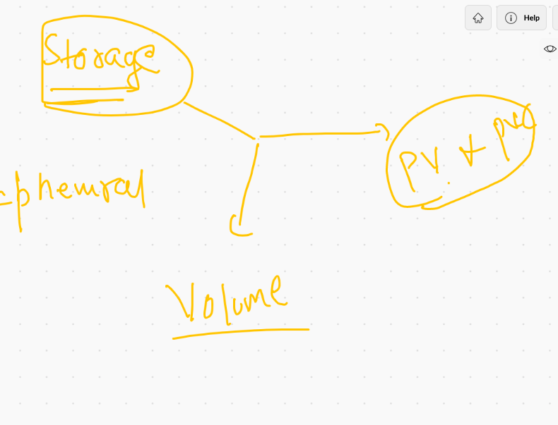
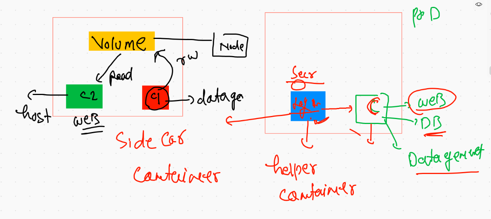

#  private registry image deploy 

## OCR to k8s deployment 


## creating deployment using OCR image

```
 kubectl  create  deployment  webappocr  --image=phx.ocir.io/axmbtg8judkl/webapp:v1  --dry-run=client -o  yaml
apiVersion: apps/v1
kind: Deployment
metadata:
  creationTimestamp: null
  labels:
    app: webappocr
  name: webappocr
spec:
  replicas: 1
  selector:
    matchLabels:
      app: webappocr
  strategy: {}
  template:
    metadata:
      creationTimestamp: null
      labels:
        app: webappocr
    spec:
      containers:
      - image: phx.ocir.io/axmbtg8judkl/webapp:v1
        name: webapp
        resources: {}
status: {}

```

### deploy the yaml 

```
❯ ls
ashupod1.yaml   dep.yaml        javapod.yaml    oraclewebapp    permission.yaml
ashusvc1.yaml   hpa.yaml        ocr.yaml        orweb.yaml
❯ kubectl  apply -f  ocr.yaml
deployment.apps/webappocr created
❯ kubectl  get  deploy
NAME        READY   UP-TO-DATE   AVAILABLE   AGE
webappocr   0/1     1            0           6s
❯ kubectl  get  deploy  -w
NAME        READY   UP-TO-DATE   AVAILABLE   AGE
webappocr   0/1     1            0           11s


```

### any private registry will give same error 

```
❯ kubectl  get  po
NAME                         READY   STATUS         RESTARTS   AGE
webappocr-5c5f4958d6-rt24f   0/1     ErrImagePull   0          44s
❯ kubectl  describe  pod webappocr-5c5f4958d6-rt24f
Name:         webappocr-5c5f4958d6-rt24f
Namespace:    ashuproject
Priority:     0
Node:         minion1/172.31.75.81
Start Time:   Fri, 30 Jul 2021 10:21:49 +0530
Labels:       app=webappocr
              pod-template-hash=5c5f4958d6
Annotations:  cni.projectcalico.org/podIP: 192.168.34.49/32
              cni.projectcalico.org/podIPs: 192.168.34.49/32
Status:       Pending
IP:           192.168.34.49
IPs:
  IP:           192.168.34.49
Controlled By:  ReplicaSet/webappocr-5c5f4958d6
Containers:
  webapp:
    Container ID:   
    Image:          phx.ocir.io/axmbtg8judkl/webapp:v1
    Image ID:       
    Port:           <none>
    Host Port:      <none>
    State:          Waiting
      Reason:       ImagePullBackOff
    Ready:          False
    Restart Count:  0
    Environment:    <none>
    Mounts:
      /var/run/secrets/kubernetes.io/serviceaccount from kube-api-access-98hsh (ro)
Conditions:
  Type              Status
  Initialized       True 
  Ready             False 
  ContainersReady   False 
  PodScheduled      True 
Volumes:
  kube-api-access-98hsh:
    Type:                    Projected (a volume that contains injected data from multiple sources)
    TokenExpirationSeconds:  3607
    ConfigMapName:           kube-root-ca.crt
    ConfigMapOptional:       <nil>
    DownwardAPI:             true
QoS Class:                   BestEffort
Node-Selectors:              <none>
Tolerations:                 node.kubernetes.io/not-ready:NoExecute op=Exists for 300s
                             node.kubernetes.io/unreachable:NoExecute op=Exists for 300s
Events:
  Type     Reason     Age                From               Message
  ----     ------     ----               ----               -------
  Normal   Scheduled  84s                default-scheduler  Successfully assigned ashuproject/webappocr-5c5f4958d6-rt24f to minion1
  Normal   Pulling    31s (x3 over 79s)  kubelet            Pulling image "phx.ocir.io/axmbtg8judkl/webapp:v1"
  Warning  Failed     30s (x3 over 77s)  kubelet            Failed to pull image "phx.ocir.io/axmbtg8judkl/webapp:v1": rpc error: code = Unknown desc = Error response from daemon: pull access denied for phx.ocir.io/axmbtg8judkl/webapp, repository does not exist or may require 'docker login': denied: Anonymous users are only allowed read access on public repos
  Warning  Failed     30s (x3 over 77s)  kubelet            Error: ErrImagePull
  Normal   BackOff    1s (x4 over 76s)   kubelet            Back-off pulling image "phx.ocir.io/axmbtg8judkl/webapp:v1"
  Warning  Failed     1s (x4 over 76s)   kubelet            Error: ImagePullBackOff
  
  
```

### secret info 


### creating secret to store docker registry info 

```
❯ kubectl  create  secret  docker-registry  ashusec1  --docker-server  phx.ocir.io --docker-username XXX0,,,nnbb/***sfdskf@gmail.com  --docker-password='XXXX...XXXXX'
secret/ashusec1 created
❯ kubectl  get  secret
NAME                  TYPE                                  DATA   AGE
ashusec1              kubernetes.io/dockerconfigjson        1      21s

```

### apply in YAMl 

```
❯ kubectl  get deploy
NAME        READY   UP-TO-DATE   AVAILABLE   AGE
webappocr   1/1     1            1           15m
❯ kubectl  expose deploy webappocr  --type NodePort  --port  80 --name s1
service/s1 exposed
❯ kubectl  get  svc
NAME   TYPE       CLUSTER-IP       EXTERNAL-IP   PORT(S)        AGE
s1     NodePort   10.101.185.204   <none>        80:32231/TCP   6s

```

## storage in k8s



## volume plugins for k8s 

[volumes](https://kubernetes.io/docs/concepts/storage/volumes/)

## storage source for volume 


## emptyDir volume implementation 

```
❯ kubectl  run  alpod  --image=alpine  --dry-run=client  -o  yaml
apiVersion: v1
kind: Pod
metadata:
  creationTimestamp: null
  labels:
    run: alpod
  name: alpod
spec:
  containers:
  - image: alpine
    name: alpod
    resources: {}
  dnsPolicy: ClusterFirst
  restartPolicy: Always
status: {}
❯ kubectl  run  alpod  --image=alpine  --dry-run=client  -o  yaml    >emptydir.yaml

```

### introdution of emptyDir type volume 


### 

```
❯ kubectl get  po
NAME    READY   STATUS    RESTARTS   AGE
alpod   1/1     Running   0          2m45s
❯ kubectl get  po  -o wide
NAME    READY   STATUS    RESTARTS   AGE     IP                NODE      NOMINATED NODE   READINESS GATES
alpod   1/1     Running   0          2m56s   192.168.179.243   minion2   <none>           <none>
❯ kubectl  exec  -ti   alpod  -- sh
/ # cd  /mnt/oracle/
/mnt/oracle # ls
data.txt
/mnt/oracle # cat  data.txt 
Hello
Hello
Hello
Hello
Hello
Hello

```

## Idea of multi contianer pod 



## reading and writing data 


##

```
❯ kubectl replace -f  emptydir.yaml --force
pod "alpod" deleted
pod/alpod replaced
❯ kubectl  get  po
NAME    READY   STATUS    RESTARTS   AGE
alpod   2/2     Running   0          6s

```

## containing containers in pod

```
❯ kubectl  get  po
NAME    READY   STATUS    RESTARTS   AGE
alpod   2/2     Running   0          6s
❯ kubectl  exec  -it  alpod  --  bash
Defaulted container "ashuc2" out of: ashuc2, alpod
root@alpod:/# cd /usr/share/nginx/html/
root@alpod:/usr/share/nginx/html# ls
index.html
root@alpod:/usr/share/nginx/html# exit
exit
❯ kubectl  exec  -it  alpod -c alpod  --  sh
/ # cd /mnt/oracle/
/mnt/oracle # ls
index.html
/mnt/oracle # 


```

### creating svc of pod 

```
❯ kubectl  get  po
NAME    READY   STATUS    RESTARTS   AGE
alpod   2/2     Running   0          3m20s
❯ kubectl  expose pod  alpod  --type NodePort  --port 80 --name  ashusvc111
service/ashusvc111 exposed
❯ kubectl get  svc
NAME         TYPE       CLUSTER-IP      EXTERNAL-IP   PORT(S)        AGE
ashusvc111   NodePort   10.107.149.15   <none>        80:31097/TCP   5s

```

## HostPath VOlume demo 

```
❯ kubectl apply -f  hostpath.yaml
deployment.apps/ashudd1 created
❯ kubectl  get  deploy
NAME      READY   UP-TO-DATE   AVAILABLE   AGE
ashudd1   1/1     1            1           6s
❯ kubectl  get  po
NAME                       READY   STATUS    RESTARTS   AGE
ashudd1-6484f4f75f-ztdrb   1/1     Running   0          12s
❯ kubectl  exec -it  ashudd1-6484f4f75f-ztdrb  -- sh
/ # ls
bin    etc    lib    mnt    opt    root   sbin   sys    usr
dev    home   media  myetc  proc   run    srv    tmp    var
/ # cd  myetc/
/myetc # ls
DIR_COLORS               hibagent-config.cfg      protocols
DIR_COLORS.256color      hibinit-config.cfg       python
DIR_COLORS.lightbgcolor  host.conf                rc.d
GREP_COLORS              hostname          

```

