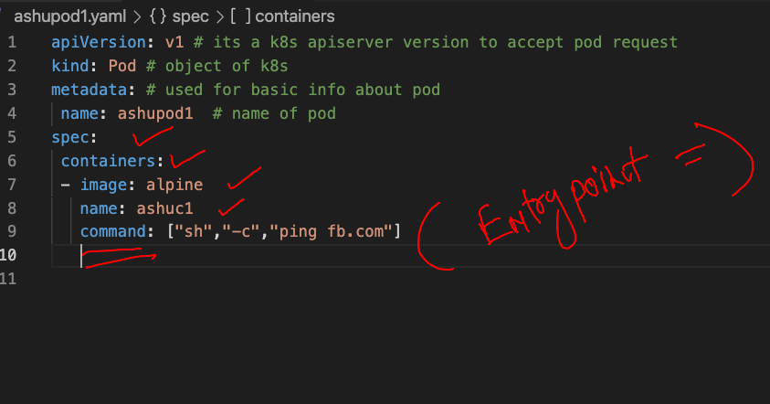
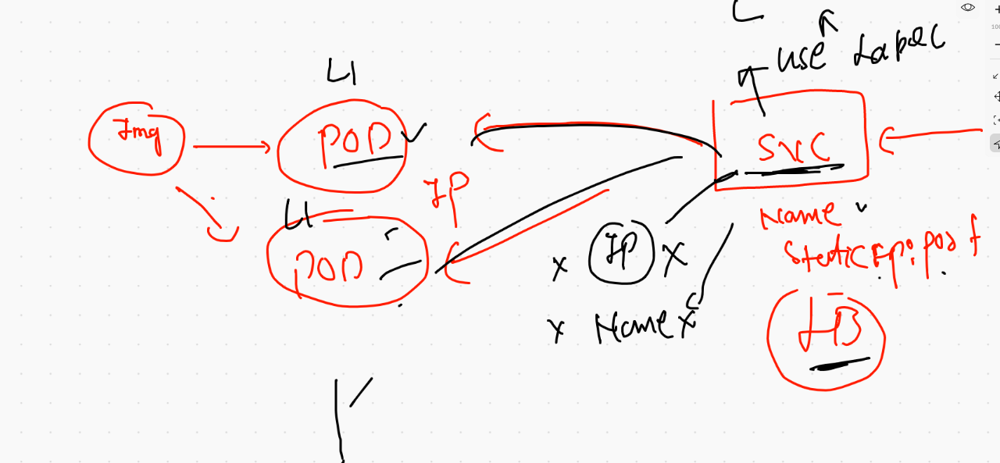

# CRE and its revision 


## more container architecture understanding 


## creating a database container 

```
336  docker  run -itd  --name  ashudb -v  ashudbvol:/var/lib/mysql/  -e MYSQL_ROOT_PASSWORD=oracel99   mysql 
  337  docker  volume  ls
  338  docker ps
  339  history 
[ec2-user@ip-172-31-65-105 ~]$ docker  ps
root@20cefb334809:/# 
root@20cefb334809:/# 
root@20cefb334809:/# exit
[ec2-user@ip-172-31-65-105 ~]$ docker  exec -it  ashudb  bash
root@20cefb334809:/# 
root@20cefb334809:/# mysql -u root -p
Enter password: 
Welcome to the MySQL monitor.  Commands end with ; or \g.
Your MySQL connection id is 8
Server version: 8.0.26 MySQL Community Server - GPL

Copyright (c) 2000, 2021, Oracle and/or its affiliates.

Oracle is a registered trademark of Oracle Corporation and/or its
affiliates. Other names may be trademarks of their respective
owners.

Type 'help;' or '\h' for help. Type '\c' to clear the current input statement.

mysql> 


```

## Docker compose for DB 

```
[ec2-user@ip-172-31-65-105 webappashu]$ docker-compose -f  ashu.yaml up  -d
Creating network "webappashu_default" with the default driver
Creating volume "webappashu_ashudbvol11" with default driver
Creating ashudbc1 ... done
[ec2-user@ip-172-31-65-105 webappashu]$ docker-compose -f  ashu.yaml ps
  Name                Command               State          Ports       
-----------------------------------------------------------------------
ashudbc1   docker-entrypoint.sh --def ...   Up      3306/tcp, 33060/tcp

```

## Pushing image to OCR

### tag 

```
 docker  tag  ubuntu:latest   phx.ocir.io/axmbtg8judkl/ubuntu:v1
 
```

### login 

```
docker  login  phx.ocir.io  -u axmbtg8judkl/learntechbyme@gmail.com 
```

### pushing 

```
docker  push phx.ocir.io/axmbtg8judkl/ubuntu:v1
```

### logout 

```
docker  logout  phx.ocir.io

```

## COntainer orchestration 

### problem


## introduction to orchestration engine 


## k8s architecture 

### kube-apiserver 


### kube-schedular 


### etcd is  a NOSQL db -- 


### k8s setup 


### method to deploy k8s cluster


### minikube 

```
 curl -LO https://storage.googleapis.com/minikube/releases/latest/minikube-darwin-amd64
  % Total    % Received % Xferd  Average Speed   Time    Time     Time  Current
                                 Dload  Upload   Total   Spent    Left  Speed
100 65.9M  100 65.9M    0     0  11.1M      0  0:00:05  0:00:05 --:--:-- 12.3M	
❯       sudo install minikube-darwin-amd64 /usr/local/bin/minikube
Password:
❯ minikube version
minikube version: v1.22.0
commit: a03fbcf166e6f74ef224d4a63be4277d017bb62e

```

### starting cluster

```
❯ minikube version
minikube version: v1.22.0
commit: a03fbcf166e6f74ef224d4a63be4277d017bb62e
❯ minikube  start  --driver=docker
😄  minikube v1.22.0 on Darwin 11.4
✨  Using the docker driver based on existing profile
👍  Starting control plane node minikube in cluster minikube
🚜  Pulling base image ...
🔄  Restarting existing docker container for "minikube" ...
🐳  Preparing Kubernetes v1.21.2 on Docker 20.10.7 ...
🔎  Verifying Kubernetes components...
    ▪ Using image gcr.io/k8s-minikube/storage-provisioner:v5
🌟  Enabled addons: storage-provisioner, default-storageclass
🏄  Done! kubectl is now configured to use "minikube" cluster and "default" namespace by default


```


## Introduction to POD 


## first POD 




## checking yaml file syntax 

```
❯ ls
ashupod1.yaml
❯ kubectl  version
Client Version: version.Info{Major:"1", Minor:"21", GitVersion:"v1.21.1", GitCommit:"5e58841cce77d4bc13713ad2b91fa0d961e69192", GitTreeState:"clean", BuildDate:"2021-05-12T14:18:45Z", GoVersion:"go1.16.4", Compiler:"gc", Platform:"darwin/amd64"}
Server Version: version.Info{Major:"1", Minor:"21", GitVersion:"v1.21.2", GitCommit:"092fbfbf53427de67cac1e9fa54aaa09a28371d7", GitTreeState:"clean", BuildDate:"2021-06-16T12:53:14Z", GoVersion:"go1.16.5", Compiler:"gc", Platform:"linux/amd64"}
❯ kubectl  apply -f  ashupod1.yaml --dry-run=client
pod/ashupod1 created (dry run)

```

### deploying pod 

```
❯ kubectl  apply -f  ashupod1.yaml
pod/ashupod1 created
❯ kubectl   get  pods
NAME       READY   STATUS    RESTARTS   AGE
ashupod1   1/1     Running   0          21s
❯ kubectl   logs -f  ashupod1
PING fb.com (157.240.16.35): 56 data bytes
^C


```

### more details about pod 

```

❯ kubectl  get  pods -o wide
NAME       READY   STATUS    RESTARTS   AGE    IP           NODE       NOMINATED NODE   READINESS GATES
ashupod1   1/1     Running   0          2m7s   172.17.0.3   minikube   <none>           <none>

░▒▓ ~ ······························································································ 02:56:23 PM ▓▒░─╮
❯                                                                                                                     ─╯

```

### accessing container inside pod 

```
❯ kubectl  exec -it   ashupod1  -- sh
/ # 
/ # 
/ # cat  /etc/os-release 
NAME="Alpine Linux"
ID=alpine
VERSION_ID=3.14.0
PRETTY_NAME="Alpine Linux v3.14"
HOME_URL="https://alpinelinux.org/"
BUG_REPORT_URL="https://bugs.alpinelinux.org/"
/ # exit


```

### kubectl remote cluster connection 

```
❯ kubectl  get  no  --kubeconfig  admin.conf
NAME         STATUS   ROLES                  AGE     VERSION
masternode   Ready    control-plane,master   7h21m   v1.21.3
minion1      Ready    <none>                 7h19m   v1.21.3
minion2      Ready    <none>                 7h20m   v1.21.3


```

### merging two cluster details 


### COntext in k8s cluster 

```
❯ kubectl  get  nodes
NAME       STATUS   ROLES                  AGE   VERSION
minikube   Ready    control-plane,master   7d    v1.21.2
❯ kubectl   config  get-contexts
CURRENT   NAME                          CLUSTER      AUTHINFO           NAMESPACE
          kubernetes-admin@kubernetes   kubernetes   kubernetes-admin   
*         minikube                      minikube     minikube           default
❯
❯
❯ kubectl   config  use-context   kubernetes-admin@kubernetes
Switched to context "kubernetes-admin@kubernetes".
❯ kubectl  get  nodes
NAME         STATUS   ROLES                  AGE     VERSION
masternode   Ready    control-plane,master   7h55m   v1.21.3
minion1      Ready    <none>                 7h53m   v1.21.3
minion2      Ready    <none>                 7h54m   v1.21.3

```

### YAML generator 

```
kubectl   run ashujavapod1 --image=dockerashu/ashujavaweb:v1    --port 8080 --dry-run=client -o yaml
apiVersion: v1
kind: Pod
metadata:
  creationTimestamp: null
  labels:
    run: ashujavapod1
  name: ashujavapod1
spec:
  containers:
  - image: dockerashu/ashujavaweb:v1
    name: ashujavapod1
    ports:
    - containerPort: 8080
    resources: {}
  dnsPolicy: ClusterFirst
  restartPolicy: Always
status: {}


```

### 

```
1846  kubectl   run ashujavapod1 --image=dockerashu/ashujavaweb:v1    --port 8080 --dry-run=client -o yaml 
 1847  kubectl   run ashujavapod1 --image=dockerashu/ashujavaweb:v1    --port 8080 --dry-run=client -o json 
❯ kubectl   run ashujavapod1 --image=dockerashu/ashujavaweb:v1    --port 8080 --dry-run=client -o yaml  >javapod.yaml

```

### done with pod deploy 

```
❯ kubectl  apply -f  javapod.yaml
pod/ashujavapod1 created
❯ kubectl  get  po
NAME           READY   STATUS    RESTARTS   AGE
ashujavapod1   1/1     Running   0          4s
ashupod1       1/1     Running   0          30m
bpod1          1/1     Running   0          13m
bpod2          1/1     Running   0          87s
jeypod1        1/1     Running   0          11m
jitendrapod1   1/1     Running   0          13m
krispod1       1/1     Running   0          12m
nishpod1       1/1     Running   0          13m
palashpod1     1/1     Running   0          9m42s
rashmipod1     1/1     Running   0          12m
❯ kubectl  get  po ashujavapod1  -o wide
NAME           READY   STATUS    RESTARTS   AGE   IP             NODE      NOMINATED NODE   READINESS GATES
ashujavapod1   1/1     Running   0          19s   192.168.34.9   minion1   <none>           <none>

```

### accessing app 

### method 1 

```
❯ kubectl   port-forward  ashujavapod1  1234:8080
Forwarding from 127.0.0.1:1234 -> 8080
Forwarding from [::1]:1234 -> 8080
Handling connection for 1234
Handling connection for 1234

```

### method2

## Introduction  to service 




